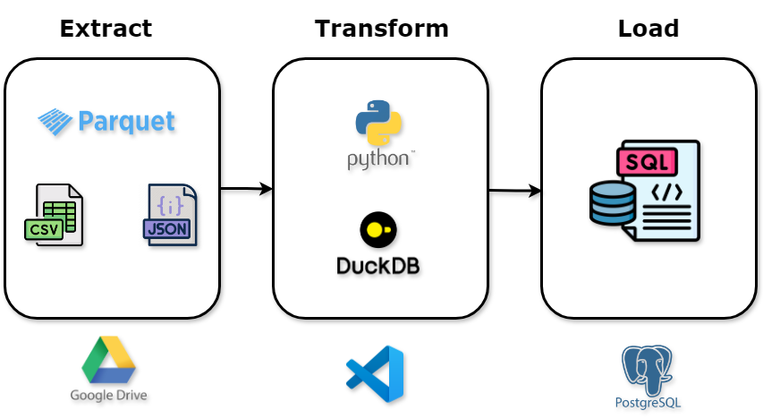

# Projeto de ETL com Python, DuckDB e PostgreSQL

## Descrição do Projeto

Este projeto tem como objetivo criar um fluxo de trabalho para baixar, processar e carregar dados de arquivos, utilizando Python, DuckDB e PostgreSQL. O processo inclui as seguintes etapas principais:

1. **Baixar arquivos do Google Drive**: Utilizando a biblioteca `gdown`, o projeto faz o download de arquivos CSV armazenados em uma pasta pública do Google Drive.
2. **Listar arquivos CSV**: Verifica os arquivos CSV presentes no diretório local.
3. **Ler arquivos CSV**: Utiliza o DuckDB para ler os arquivos CSV e criar dataframes.
4. **Transformar dados**: Realiza transformações nos dados, como a criação de uma coluna "Status" que indica se o aluno está "APROVADO" ou "REPROVADO" com base em sua nota.
5. **Carregar dados no PostgreSQL**: Utiliza o SQLAlchemy para carregar os dados transformados em uma tabela PostgreSQL.

## Melhorias futuras

1. Após um determinado período a tabela "historico_arquivos" é apagada do Web Service. Se já foi realizada uma carga anteriormente, os dados que já foram submetidos serão carregados novamente, duplicando os dados. **Identificar e corrigir esse problema.**